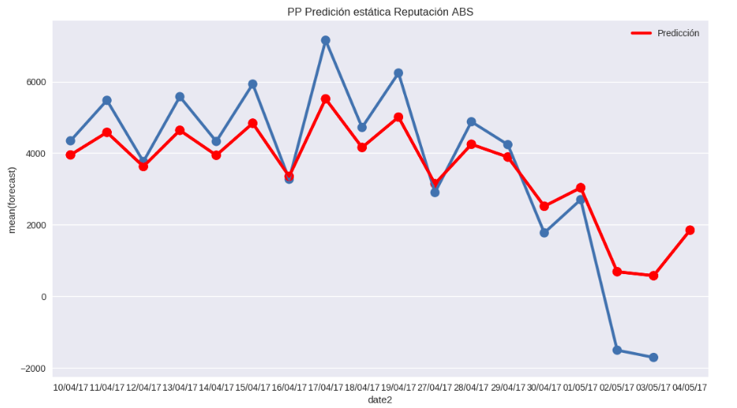

% El valor de los datos en el entorno de media
% Miguel Sánchez de León Peque
% 2017-12-13

Sobre nosotros
==============

---

{width=30%}

- 15+ años
- Procesamiento, análisis y visualización de datos
- Integración en la nube, migración (Azure)

---

Sobre mí
--------

- Ingeniero industrial (programador, analista...)
- I+D en OpenSistemas
- [github.com/Peque](https://github.com/Peque://github.com/Peque/)

electiona.com
=============

Solución integral
-----------------

- Análisis y visualización
- Tiempo real
- Histórico
- Simulador de mayorías

---

Machine learning
================

Extracción
----------

- Sentimiento
- Popularidad
- Impacto

---

{width=60%}

Clasificación
-------------

- Sentimiento :+1: :-1:
- Supervisado

---

Word2vec
--------

Modelos
-------

Resultados
----------

Modelo                       | Acierto
-----------------------------|--------
Support Vector Machine       | 80%
Convolutional Neural Network | 76%
Random forest                | 74%

Popularidad
-----------

- ¿Se habla bien?
- ¿Se habla mucho?
- ¿Se comparte y gusta?

Previsión
---------

Herramientas
============

---

---

¡Gracias!
=========

Datos de contacto
-----------------

- msdeleon@opensistemas.com
- [www.opensistemas.com](www.opensistemas.com)
- @opensistemas
