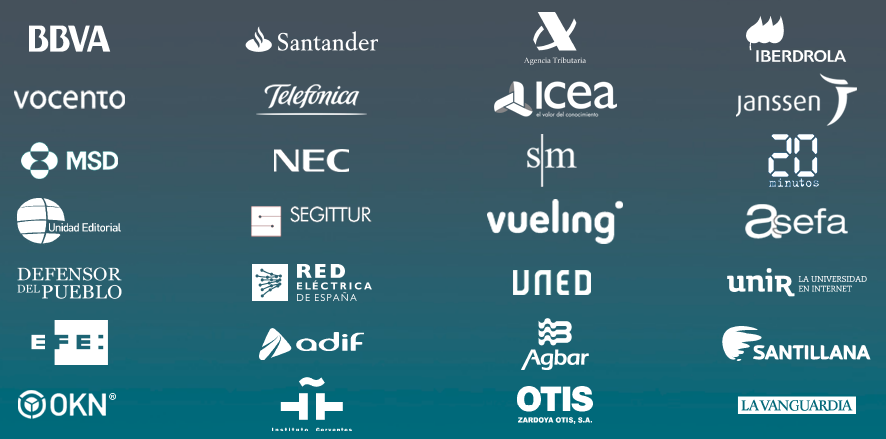
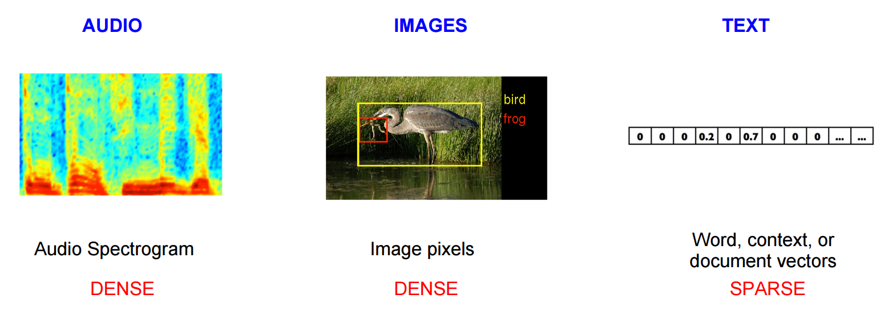
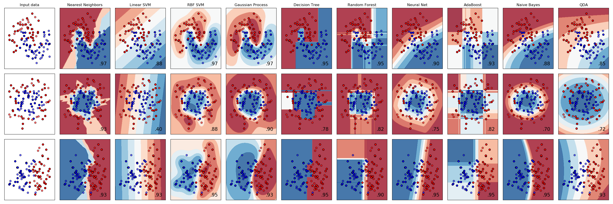

% El valor de los datos en el entorno de media
% Miguel Sánchez de León Peque
% 2017-12-13

Sobre nosotros
==============

OpenSistemas
------------

- 15+ años
- Procesamiento, análisis y visualización de datos
- Integración en la nube, migración (Azure)
- Servicios y productos

---

Sobre mí
--------

- Ingeniero industrial (programador, analista...)
- I+D en OpenSistemas
- [github.com/Peque](https://github.com/Peque://github.com/Peque/)

electiona.com
=============

Solución integral
-----------------

- Análisis y visualización (arcos, tablas, mapas...)
- Simulador de mayorías
- Tiempo real
- Histórico

Arcos, tablas, mapas
--------------------

Machine learning
================

Ingesta
-------

Clasificación
-------------

- Sentimiento :+1: :-1:
- Supervisado

---

Word2vec
--------

Modelos
-------

---

Modelo                       | Acierto
-----------------------------|--------
Random forest                | 74%
Support Vector Machine       | 80%
Convolutional Neural Network | 76%
Gradient-Boosted Tree        | 74%

Popularidad
-----------

Previsión
---------

Herramientas
============

---

---

¡Gracias!
=========

Datos de contacto
-----------------

- msdeleon@opensistemas.com
- [www.opensistemas.com](www.opensistemas.com)
- @opensistemas
